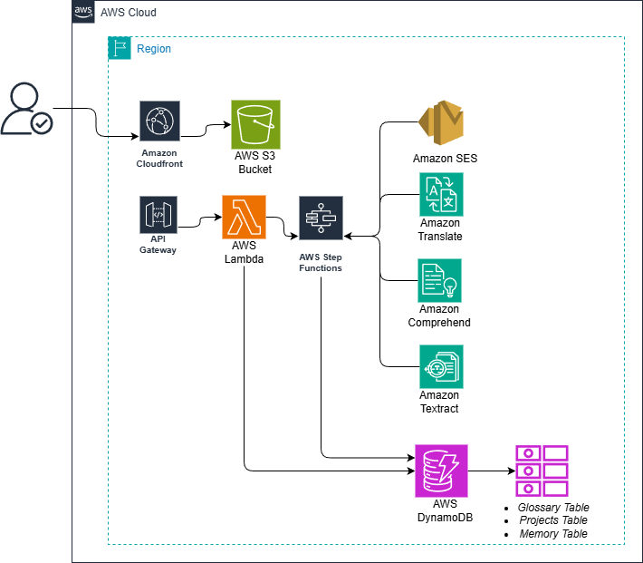

# 🌐 Plataforma de traducción inteligente serverless

**Proyecto AWS #27 - (Integración con IA)**

## 📋 Descripción
Este proyecto es una evolución de la herramienta CAT (Computer-Assisted Translation) implementada sobre una arquitectura **Serverless** en AWS. [cite_start]A diferencia de prototipos anteriores, esta versión integra **Inteligencia Artificial** para digitalizar y traducir documentos automáticamente[cite: 1333].

El sistema permite subir archivos (tanto `.txt` como `.pdf`), extrae su contenido mediante OCR inteligente, lo traduce utilizando redes neuronales y notifica al usuario vía email cuando el proceso finaliza. 
Si desea probar puede acceder al sitio web de prueba: 
http://plataforma-traduccion-pdfs.s3-website.us-east-2.amazonaws.com
## 🏗️ Arquitectura
El flujo de datos sigue un modelo reactivo (Event-Driven) iniciado por la carga de archivos:

### Flujo de Trabajo Actualizado:
1.  **Ingesta:** El usuario sube un archivo a **S3** (`uploads/`). [cite_start]Soporta formatos `.txt` y `.pdf`[cite: 1340].
2.  **Detección y Extracción:** Una función **Lambda** detecta el formato:
    * [cite_start]Si es PDF: Invoca a **Amazon Textract** para realizar OCR y extraer texto plano[cite: 1341, 1401].
    * [cite_start]Si es TXT: Lee el contenido directamente de S3[cite: 1408].
3.  [cite_start]**Traducción Neuronal:** El texto segmentado se envía a **Amazon Translate** (servicio real, sin simulaciones) para traducir del inglés al español[cite: 1428, 1445].
4.  [cite_start]**Persistencia:** Los pares de segmentos (origen-destino) se almacenan en **DynamoDB**[cite: 1343].
5.  [cite_start]**Notificación:** Al finalizar, **Amazon SNS** envía un correo electrónico al administrador avisando que el documento está listo[cite: 1344, 1462].
6.  **Visualización:** El Frontend consulta los resultados a través de **API Gateway**.

### Stack Tecnológico:
* **Compute:** AWS Lambda (Python 3.9).
* [cite_start]**AI/ML:** * **Amazon Textract:** OCR para PDFs[cite: 1360].
    * [cite_start]**Amazon Translate:** Traducción automática[cite: 1361].
* **Storage:** Amazon S3.
* **Database:** Amazon DynamoDB (Tablas On-Demand).
* [cite_start]**Messaging:** Amazon SNS (Notificaciones Email)[cite: 1362].
* **API:** Amazon API Gateway.

## ⚙️ Configuración y Desafíos Técnicos

### Permisos IAM
[cite_start]Para el correcto funcionamiento de la v2, el Rol de Ejecución de Lambda requiere las siguientes políticas gestionadas [cite: 1359-1362]:
* `AmazonTextractFullAccess`
* `TranslateFullAccess`
* `AmazonSNSFullAccess`

### Soluciones a Problemas (Bitácora v2)
[cite_start]Durante la implementación de la Fase 2, se superaron los siguientes retos técnicos[cite: 1490]:

| Reto Técnico | Contexto | Solución Implementada |
| :--- | :--- | :--- |
| **Procesamiento de PDF** | S3 no permite leer el texto de archivos binarios/PDF directamente. | [cite_start]Se integró **Amazon Textract** para extraer el texto antes de traducir[cite: 1490]. |
| **Permisos de IA** | La función fallaba con `AccessDenied` al invocar `translate_text`. | [cite_start]Se actualizaron las políticas IAM del LabRole para permitir acceso a servicios de IA[cite: 1490]. |
| **Notificaciones Asíncronas** | Necesidad de saber cuándo termina un proceso pesado sin recargar la página. | [cite_start]Implementación de **Amazon SNS** al final del flujo de la Lambda[cite: 1490]. |
| **Serialización JSON** | Error con tipos `Decimal` de DynamoDB en la API. | [cite_start]Implementación de clase `DecimalEncoder` en el handler de la API[cite: 1482]. |

## 🚀 Instalación y Uso

1.  **Configurar SNS:**
    * Crear un Tópico en SNS (`TranslationAlerts`) y suscribir tu email.
    * [cite_start]**Importante:** Confirma la suscripción en el enlace que llegará a tu correo[cite: 1477].
2.  **Despliegue:**
    * [cite_start]Actualizar la variable `TOPIC_ARN` en el código de la Lambda con el ARN de tu tópico SNS[cite: 1380].
    * Subir el código actualizado (`lambda_function.py`) que incluye la lógica de Textract y Translate.
3.  **Prueba:**
    * Sube un archivo PDF en inglés a la carpeta `uploads/` del bucket S3.
    * Espera el correo de notificación de SNS.
    * Verifica la traducción en el Frontend web.

---
**Arquitecto Cloud:** [Sebastian Salazar Perez]
**Fecha:** 3 de diciembre de 2025
